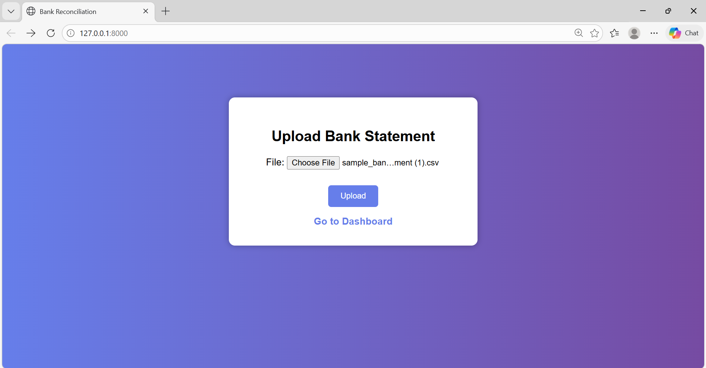
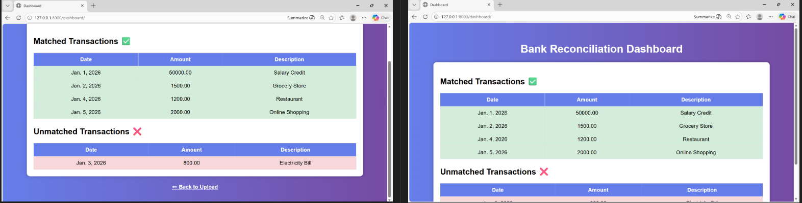

# 💳 AI Bank Reconciliation System

## 📌 Project Overview
This project is a Django-based web application that automates bank reconciliation by analyzing uploaded bank statements (CSV/Excel) and identifying matched and unmatched transactions.

---

## 🚀 Features
- Upload bank statements (CSV/Excel)
- Automatic transaction matching
- Dashboard for matched & unmatched transactions
- Data processing using Pandas

---

## 🛠 Tech Stack
- Python
- Django
- Pandas
- HTML/CSS

---

## ▶️ How to Run

1. Clone the repository:
git clone https://github.com/RinshithaShiriK/AI-Bank-Reconciliation-System.git

2. Navigate to project:
cd AI-Bank-Reconciliation-System

3. Install dependencies:
pip install -r requirements.txt

4. Run server:
python manage.py migrate
python manage.py runserver

---

## 📸 Screenshots

### Upload Page

### Dashboard

## 🎯 Future Improvements
- AI-based smart matching
- Graph dashboards
- Export reports

---

## 👩‍💻 Author
Rinshitha Shirin k
